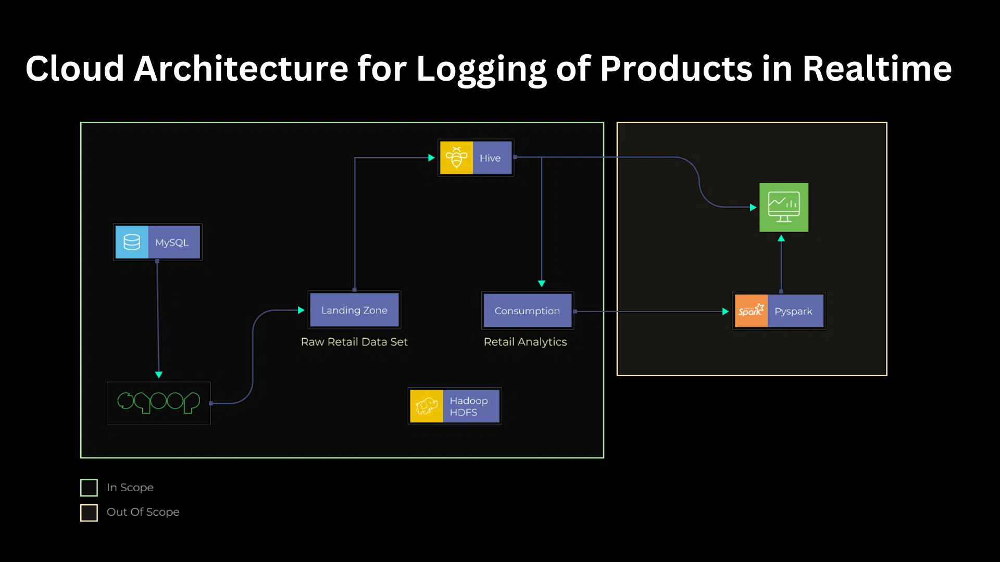
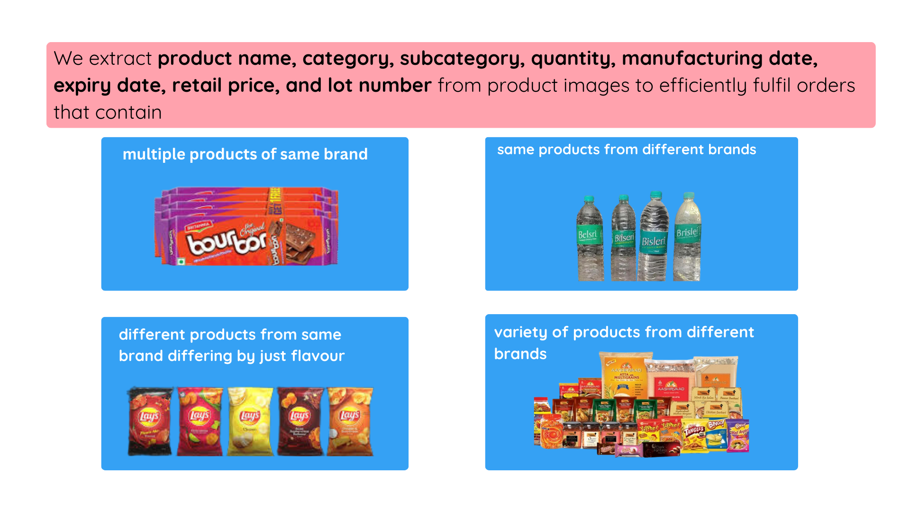
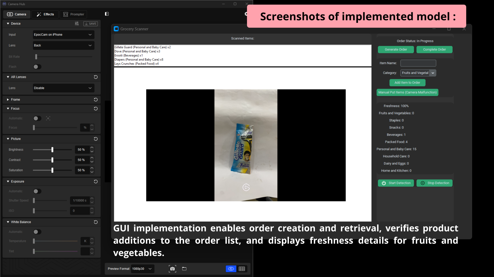

---

# Smart Retail Scanner Pro 🛒

[](https://opensource.org/licenses/MIT)
[](https://www.python.org/downloads/)
[](https://opencv.org/)
[](https://www.tensorflow.org/)
[](https://pytorch.org/)

An intelligent retail automation system designed to minimize waste and optimize inventory management using advanced computer vision and machine learning. This solution enhances efficiency by automatically identifying and alerting warehouse staff to expired or near-expiry fresh produce and packaged goods, reducing spoilage and encouraging timely restocking. Ideal for large-scale retail and e-commerce, this system promotes sustainable practices by supporting better resource utilization, waste reduction, and a more seamless shipping experience.

## 🎥 Demo

[](https://drive.google.com/file/d/1jBDCbwQ-LGEu_Cue_FSATwPt_B7aQYlB/view?usp=sharing)

## ✨ Features

- **Real-time Product Detection**: Automated scanning and recognition of products using computer vision
- **One-Click Interface**: User-friendly for warehouse staff, allowing quick switching between automatic and manual modes
- **User Alerts**: Real-time notifications for incorrect, missing, extra, or expired products in orders
- **Smart Inventory Management**: Tracks product movement and updates inventory in real-time
- **Freshness Detection**: AI-powered OCR-based assessment for perishable goods and expiration detection for packaged products
- **Scalability**: Efficient deployment across all product categories with minimal hardware upgrades
- **Hybrid Cloud-Edge Model**: Uses low-cost edge devices for real-time inference and cloud for centralized logging and analytics
- **Logging System**: Continuous logging of order and item data, helping identify frequently mis-scanned products
- **User-Friendly Interface**: Modern dark-themed UI built with CustomTkinter for ease of use

## 🛠️ Tech Stack

- **Frontend**: CustomTkinter, Matplotlib (ONLY IN IDEA SUBMISSION WE ARE WORKING ON A MERN STACK APP)
- **Backend**: Python 3.8+
- **Computer Vision**: OpenCV, imutils
- **ML/AI**:
  - PyTorch (Quantized models for edge deployment)
  - Qwen-VL2-2B (fine-tuned for OCR-based freshness detection)
  - MobileNet for human filtering
- **Database**: SQLite3
- **Edge Computing**: Compatible with NVIDIA Jetson Nano and Raspberry Pi
- **Cloud Integration**: Configurable cloud logging to minimize idle server times
- **Deployment**: Docker containers for easy scaling
- **Monitoring**: Custom logging and performance metrics

## 🚀 Getting Started

### Prerequisites

- GPU with at least 4GB VRAM is recommended.

```bash
python -m pip install -r requirements.txt
```

### Running the Application

```bash
python GUI_Grocery_tracker_filter.py
```

## 🏗️ Architecture

The system operates on a hybrid edge-cloud architecture:

1. **Edge Layer** (Jetson Nano/Raspberry Pi):
   - Real-time video processing and product recognition
   - Local caching and preprocessing
   - Quantized ML models for efficient inference with just 8GB RAM and 4GB VRAM


2. **Cloud Layer**:
   - Centralized logging and data analytics
   - Model updates and inventory synchronization
   - Storage and processing for long-term analytics




## 📊 Performance

- **Average Detection Time**: <500ms
- **Detection Accuracy**: F1 score of 0.832, with >95% accuracy in controlled environments
- **Camera Support**: Up to 4 simultaneous feeds
- **Memory Footprint**: <2GB on edge devices



## 📸 Interface



## 🔒 Security Features

- **Data Transmission**: Encrypted and secure
- **Role-Based Access Control**: Ensures only authorized access
- **Audit Logging**: Keeps detailed logs for analysis and security
- **Cloud Integration**: Fully secure and configurable
Here’s an expanded section on challenges and solutions for the README:

---

## 🏆 Challenges and Solutions

### 1. **Scalability**
   - **Challenge**: Our system needed to handle a wide range of product categories and locations, especially during peak times, with minimal hardware upgrades. Given Amazon’s large operational scale, the solution also had to be easily deployable and adaptable across different warehouse setups.
   - **Solution**: We designed a scalable hybrid cloud-edge model that efficiently supports high traffic volumes. By deploying quantized, fine-tuned Qwen-VL models on low-cost edge devices (e.g., Jetson Nano), the system can handle real-time inferences at the warehouse level, reducing reliance on central servers. This edge-centric approach minimizes latency and optimizes resource allocation, ensuring each warehouse can operate independently with minimal intervention from centralized cloud services. Additionally, the cloud component is designed to handle long-term storage, analytics, and model updates, seamlessly syncing with edge devices and keeping infrastructure upgrades to a minimum.

### 2. **Usability**
   - **Challenge**: Warehouse staff may have limited technical training, so the system needed to be highly intuitive, user-friendly, and reliable, requiring minimal interaction while handling complex tasks.
   - **Solution**: We developed a one-click interface with a dark-themed UI for easy readability and real-time response. The interface allows staff to switch between automatic and manual modes instantly, view order details, and monitor the status of each item in real-time. Additionally, we incorporated real-time user alerts that flag any incorrect, missing, extra, or expired products, enabling staff to make quick corrections. This simplified UI design ensures that minimal training is required, allowing staff to focus on operational efficiency without being distracted by complex system interactions.

### 3. **Infrastructure Efficiency**
   - **Challenge**: Given Amazon’s diverse infrastructure, the system needed to optimize existing resources without requiring extensive additional investment.
   - **Solution**: Our hybrid model leverages both edge and cloud resources to maximize efficiency. By performing real-time inferencing on edge devices, we reduce the load on central servers, which in turn lowers idle server time and operational costs. A TCP connection ensures smooth data transfer between the edge and cloud, allowing for seamless data logging and analysis while keeping network usage optimized. Furthermore, our cloud-based logging system supports centralized monitoring and reporting, helping to streamline operations and reduce waste from unnecessary compute cycles. This approach minimizes the need for frequent upgrades and better utilizes the available resources across Amazon's distributed network.

--- 

This expanded section describes the specific challenges encountered and how the system architecture and design choices directly address each one.

## 📝 License

This project is licensed under the MIT License - see the [LICENSE](LICENSE) file for details.

## 🙏 Acknowledgments

- OpenCV community
- PyTorch team
- CustomTkinter developers
- Huggingface Community for open-source models

## 📞 Contact

For any queries regarding implementation or collaboration, please reach out to Prathamjain3903@gmail.com

--- 
